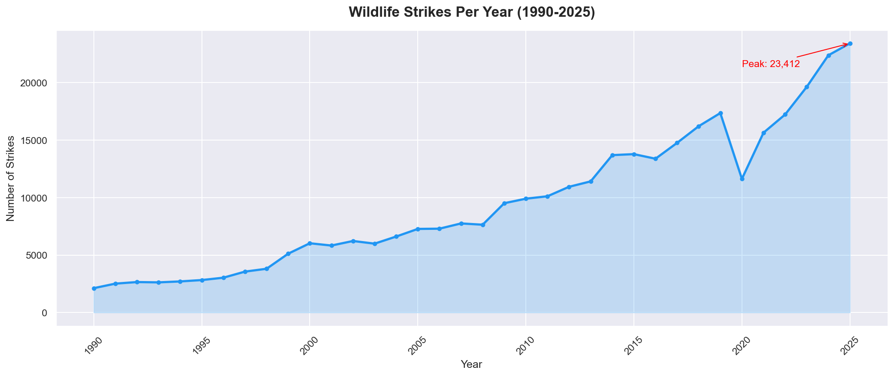
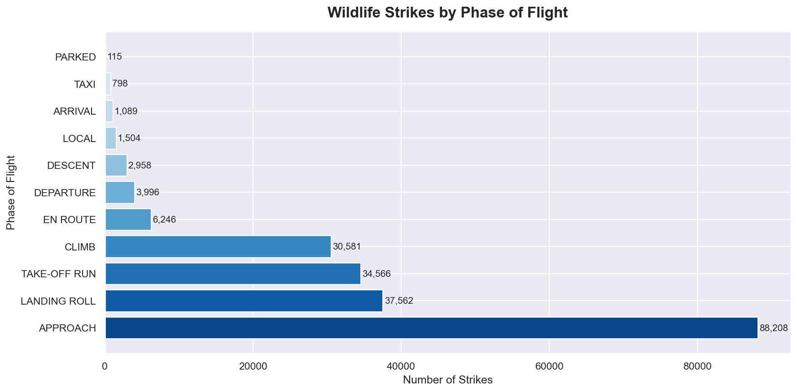
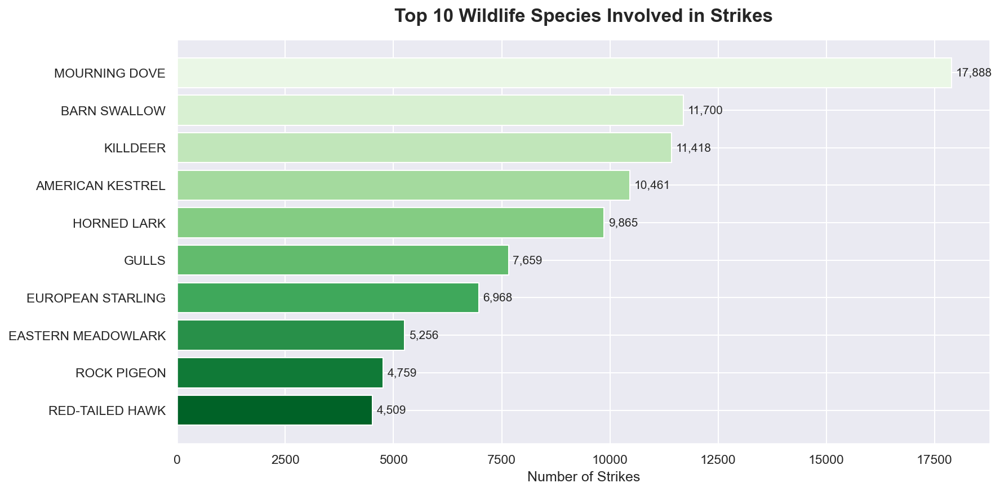
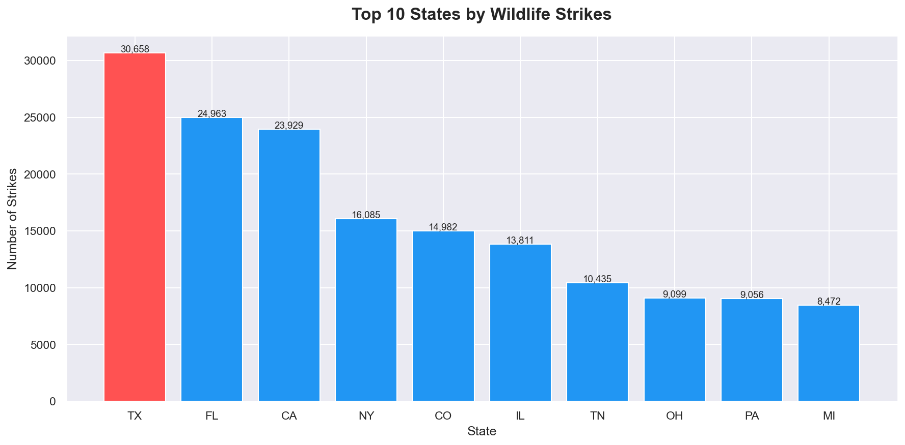
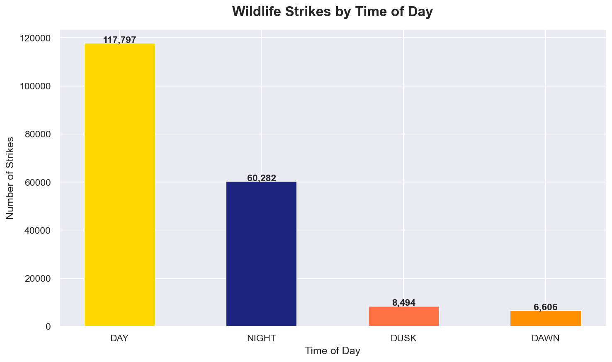
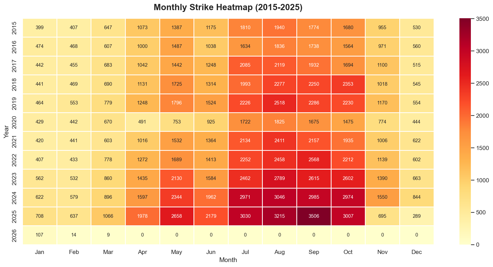

# FAA Wildlife Strike Analysis


## Project Overview

Analysis of **342,201 real FAA wildlife strike records** spanning 35 years (1990–2025)
to identify high-risk flight phases, dangerous species, and airport-level risk patterns
in US aviation safety.

> **Data Source:** [FAA National Wildlife Strike Database](https://wildlife.faa.gov) — Official US Government Data

---

## Problem Statement

Wildlife strikes pose a serious and growing safety threat to aviation.
This project analyzes 35 years of FAA strike data to surface actionable
safety insights for aviation authorities and airport management teams.

---

## Project Structure

```
FAA_Wildlife_Strike_Analysis/
├── FAA_Wildlife_Strike_Analysis.ipynb  ← Main analysis notebook
├── wildlife_clean.csv                  ← Cleaned dataset
├── chart1_yearly_trend.png             ← Strikes per year
├── chart2_phase_of_flight.png          ← Risk by flight phase
├── chart3_top_species.png              ← Dangerous species
├── chart4_top_states.png               ← High-risk states
├── chart5_damage_distribution.png      ← Damage breakdown
├── chart6_time_of_day.png              ← Time of day analysis
├── chart7_monthly_heatmap.png          ← Monthly patterns
└── README.md
```

---

## Key Insights

| # | Insight |
|---|---------|
| 1 | Wildlife strikes grew **281%** from 2000 to 2025 |
| 2 | **APPROACH** phase accounts for 42.5% of all strikes |
| 3 | **Mourning Dove** is the most dangerous identified species (17,888 strikes) |
| 4 | **Texas** leads all states with 30,658 recorded strikes |
| 5 | Night strikes are fewer but cause disproportionately more damage |
| 6 | **89 aircraft** completely destroyed by wildlife strikes over 35 years |

---

## Visualizations

### Strikes Per Year (1990–2025)


### Strikes by Phase of Flight


### Top 10 Wildlife Species


### Top 10 High-Risk States


### Damage Level Distribution


### Strikes by Time of Day


### Monthly Strike Heatmap (2015–2025)


---

## Recommendations

**1. Focus wildlife deterrence during Approach & Landing phases**
- Over 75% of strikes happen at low altitude during takeoff/landing
- Airports should deploy active bird control during peak flight hours

**2. Target High-Risk States with additional resources**
- Texas, Florida and California account for the highest strike volumes
- These airports need year-round wildlife management programs

**3. Improve night-time wildlife detection systems**
- Night strikes cause disproportionately more damage
- Investing in radar-based bird detection systems at major airports
  would significantly reduce serious incidents

---

## Conclusion

This analysis of **342,201 FAA wildlife strike records** from 1990–2025 reveals
that wildlife strikes are a growing aviation safety concern.

Key takeaways:
- Strikes have grown **281%** since 2000 driven by air traffic growth and better reporting
- **Approach and landing phases** are highest risk — occurring below 1,000ft altitude
- **Small birds** like Mourning Doves cause the most incidents due to large flock sizes
- While **98%+ of strikes cause no serious damage**, the remaining cases represent
  real safety and economic risk to the aviation industry

Targeted wildlife management at high-risk airports during critical flight phases
can significantly improve aviation safety outcomes.

---

## Tools & Technologies

| Tool | Purpose |
|------|---------|
| Python 3.10 | Core programming language |
| Pandas | Data cleaning & analysis |
| NumPy | Numerical operations |
| Matplotlib | Data visualizations |
| Seaborn | Statistical charts |
| Plotly | Interactive charts |

---
## Dataset

The data files are too large for GitHub (100MB+ limit).
Download them from Google Drive:

| File | Description | Link |
|------|-------------|------|
| `wildlife.xlsx` | Raw FAA dataset | [Download]([your-google-drive-link-here](https://docs.google.com/spreadsheets/d/1CDvhZIh4_nP6ekRrIEgTWTEAGYORykB/edit?usp=drive_link&ouid=101135495440533255928&rtpof=true&sd=true)) |
| `wildlife_clean.csv` | Cleaned dataset | [Download](https://drive.google.com/file/d/1MaCcgkmDes6XnRSkHaSZIlx5gzS1bis_/view?usp=drive_link) |

> **Or** download directly from official source:
> [FAA Wildlife Strike Database](https://wildlife.faa.gov/home)
## How to Run

```bash
# 1. Clone the repository
git clone https://github.com/jainarein/FAA-Wildlife-Strike-Analysis.git

# 2. Install dependencies
pip install pandas numpy matplotlib seaborn plotly openpyxl

# 3. Open the notebook
jupyter notebook FAA_Wildlife_Strike_Analysis.ipynb
```

---

## Author

**Arein Jain**

[](https://github.com/jainarein)
[](https://linkedin.com/in/arein-jain)

---

*Data Source: FAA National Wildlife Strike Database (Official US Government)*
